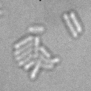
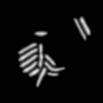
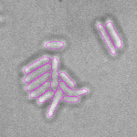

# TaLiSSman: TrAnsmitted LIght Stack SegMentAtioN
Segmentation of bacteria growing in agar-pads, imaged by transmitted light (stacks)

## Network architecture:
- Based on U-net
- At first layer, Z-axis is both:
  - considered as channel axis with 2D convolutions
  - reduced using 3D convolutions and 3D maxpooling

## How it works
- Expected input images are stack of 2D images, with Z-axis last : I = [batch, Y, X, Z]
- Segmentation is performed by regression of the Euclidean Distance Map (EDM).
- This repository does not include the downstream watershed step to obtain labeled images.

| Input transmitted-light Stack | Predicted EDM | Segmented Bacteria |
| :---:         |          :---: |          :---: |
|  |     |  |
